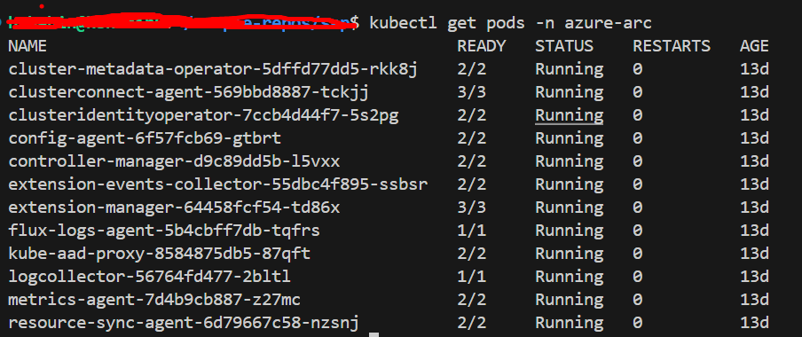
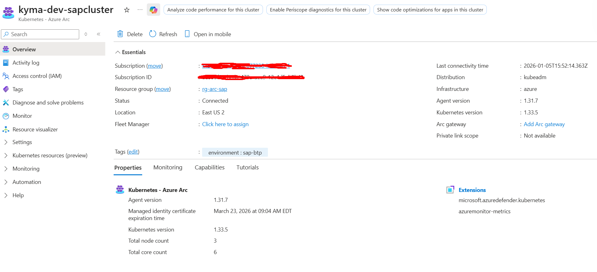
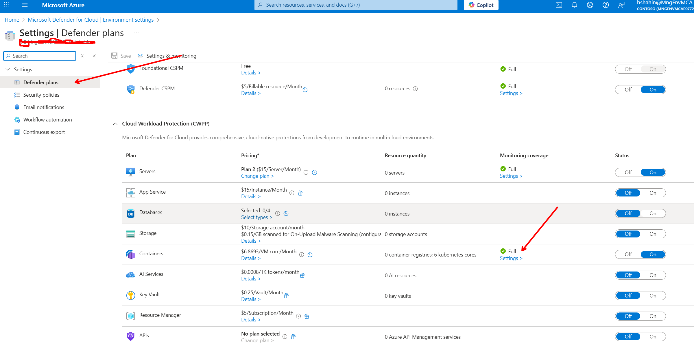
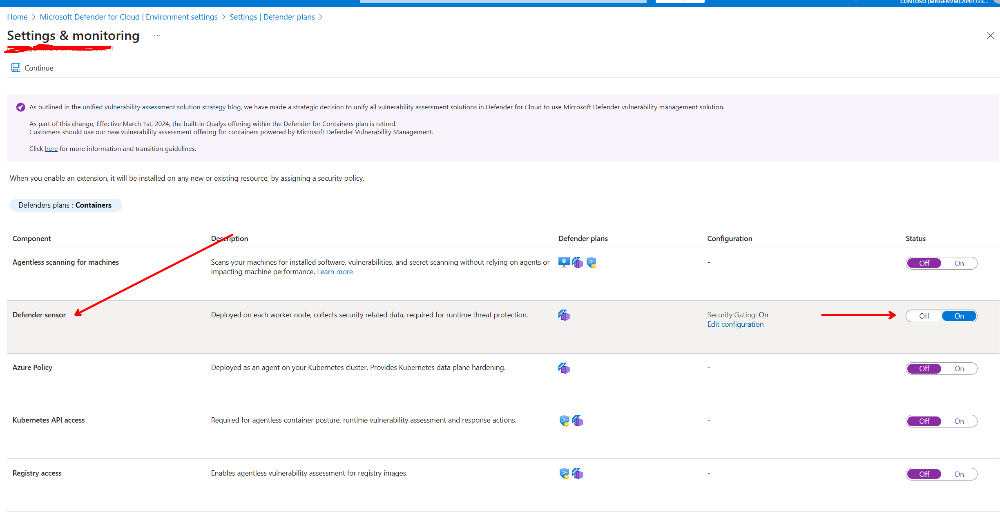
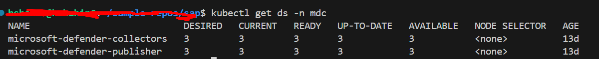
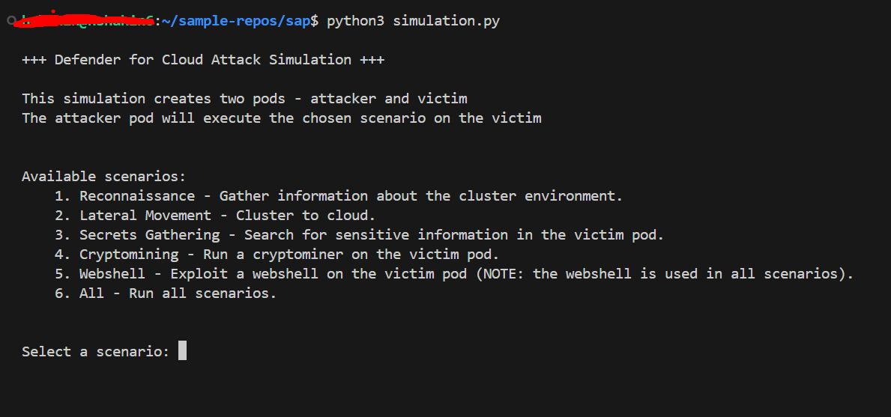
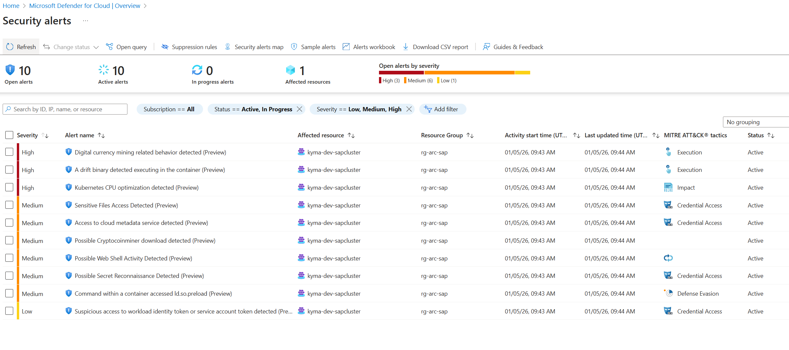
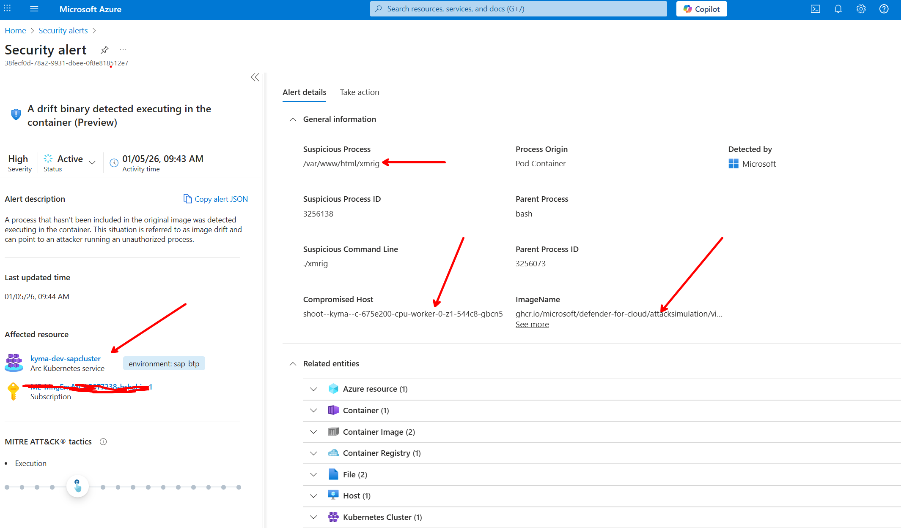

# Securing an external Kubernetes cluster with Microsoft Defender for Containers (via Azure Arc)

When I say “secure Kubernetes”, I’m not just thinking about admission policies and CIS checklists.

I’m thinking about the moment **something is already running** and turns into a problem: a web shell lands in a pod, a container starts burning CPU for crypto mining, or someone drops network scanning tools into an otherwise boring workload.

That’s exactly what Defender for Containers calls **workload runtime detection** (for example: web shell activity, crypto mining activity, network scanning tools, and binary drift detection) — and it’s powered by the Defender sensor watching workload runtime activity (including process creation events). (Docs: [Kubernetes alerts — Workload runtime detection](https://learn.microsoft.com/en-us/azure/defender-for-cloud/alerts-containers#workload-runtime-detection))

If you’re running **SAP BTP, Kyma runtime**, this runtime-focused angle matters. Kyma already comes with a lot of “platform hardening” out of the box (for example, the control plane is managed by Gardener and aligned to DISA STIG requirements). (Docs: [Kyma security concepts — Kubernetes control plane](https://github.com/SAP-docs/btp-cloud-platform/blob/main/docs/60-security/kyma-security-concepts-dbf4503.md#kubernetes-control-plane))

Kyma also states that Kubernetes API server audit logging is active, but those audit logs are written to SAP’s Platform Logging Service — and the separate Kyma auditing doc notes you don’t have direct access to the audit logs without going through a support ticket. That’s a totally valid operating model, but it’s not the same as **runtime detections inside the node/workload** (process activity, crypto mining heuristics, etc.). (Docs: [Kyma security concepts — Kubernetes native audit logging configuration](https://github.com/SAP-docs/btp-cloud-platform/blob/main/docs/60-security/kyma-security-concepts-dbf4503.md#kubernetes-native-audit-logging-configuration), [Auditing and logging information in Kyma — Retrieving audit log entries](https://github.com/SAP-docs/btp-cloud-platform/blob/main/docs/60-security/auditing-and-logging-information-in-kyma-935e241.md#retrieving-audit-log-entries))

That’s the “why” for me: I want **real-time threat protection that produces actionable alerts** for suspicious activity at the cluster, node, and workload levels — and for Kyma, I’m intentionally focusing on the **sensor-backed runtime detections**. (Docs: [Defender for Containers introduction — Run-time protection for Kubernetes nodes and clusters](https://learn.microsoft.com/en-us/azure/defender-for-cloud/defender-for-containers-introduction#run-time-protection-for-kubernetes-nodes-and-clusters))

Now the practical problem: if the cluster isn’t AKS—on‑prem, edge, or another cloud—I still want that runtime protection **without replatforming**. My approach is to connect the cluster to **Azure Arc-enabled Kubernetes**, then enable **Microsoft Defender for Containers** so Defender can deploy its security components as **Arc extensions**. (Docs: [Azure Arc-enabled Kubernetes overview](https://learn.microsoft.com/en-us/azure/azure-arc/kubernetes/overview), [Deploy and manage Arc-enabled Kubernetes extensions](https://learn.microsoft.com/en-us/azure/azure-arc/kubernetes/extensions))

---

## What

### What I’m doing (in one sentence)

1) connecting it to Azure as an **Azure Arc-enabled Kubernetes** resource, then
2) enabling **Microsoft Defender for Containers**, and
3) deploying/verifying the **Defender sensor** so I get runtime protection.

### What gets installed on my cluster

1) **Arc agents**: these show up when I connect the cluster to Azure Arc. They run in the `azure-arc` namespace and maintain the outbound connection back to Azure. (Docs: [Quickstart: Connect an existing Kubernetes cluster to Azure Arc](https://learn.microsoft.com/en-us/azure/azure-arc/kubernetes/quickstart-connect-cluster))

2) **Defender for Containers components**:

- **Defender sensor**: a lightweight DaemonSet deployed on each node to collect runtime telemetry (using eBPF) and related security signals. This is what enables **workload runtime detection** (for example: web shell activity, crypto mining activity, network scanning tools, and binary drift detection). For unmanaged clusters, it’s deployed as an Arc-enabled Kubernetes extension. (Docs: [Defender for Containers architecture](https://learn.microsoft.com/en-us/azure/defender-for-cloud/defender-for-containers-architecture), [Kubernetes alerts — Workload runtime detection](https://learn.microsoft.com/en-us/azure/defender-for-cloud/alerts-containers#workload-runtime-detection))

If you’re a “mental model” person: **Arc gives me the Azure control plane bridge; Defender uses Arc extensions to bring security into the cluster.** (Docs: [Deploy and manage Arc-enabled Kubernetes extensions](https://learn.microsoft.com/en-us/azure/azure-arc/kubernetes/extensions))

---

## Why

### Why I use Arc as the foundation

I don’t want a different operational model for every cluster. Arc turns clusters into Azure Resource Manager resources, which means I can inventory, tag, and manage them from Azure. That’s exactly what Arc-enabled Kubernetes is for. (Docs: [Azure Arc-enabled Kubernetes overview](https://learn.microsoft.com/en-us/azure/azure-arc/kubernetes/overview))

One more underrated benefit once the cluster is connected:

- **Governance at scale (Resource Graph)**: because the cluster is now an Azure resource, I can query it (and all my other Arc-enabled clusters) through **Azure Resource Graph** for fleet-wide inventory/reporting.
- **Extension platform**: Arc-enabled Kubernetes supports installing **extensions**, so Defender isn’t the only “add-on” I can deploy. I’ll cover other useful extensions in future posts.

(Docs: [Azure Resource Graph overview](https://learn.microsoft.com/en-us/azure/governance/resource-graph/overview), [Deploy and manage Arc-enabled Kubernetes extensions](https://learn.microsoft.com/en-us/azure/azure-arc/kubernetes/extensions))

### Why Defender for Containers is worth it for external clusters

For me, Defender for Containers is worth the setup effort on non-AKS clusters for two reasons:

1. **Runtime signal**: the Defender sensor provides runtime threat protection signals on unmanaged clusters via an Arc extension. (Docs: [Defender for Containers architecture](https://learn.microsoft.com/en-us/azure/defender-for-cloud/defender-for-containers-architecture))
2. **I can prove it’s working**: Microsoft provides a verification checklist (CLI + kubectl + portal) so I can validate connectivity, extension provisioning, sensor pods, and whether alerts are showing up. (Docs: [Verify Defender for Containers on Arc-enabled Kubernetes](https://learn.microsoft.com/en-us/azure/defender-for-cloud/defender-for-containers-arc-verify))

### Why I start with networking (because it’s always networking)

Both Arc and Defender depend on outbound connectivity to specific endpoints. If I skip this, onboarding turns into a confusing “why is the extension stuck?” session.

- Arc’s authoritative egress list is in the network requirements doc. (Docs: [Azure Arc-enabled Kubernetes network requirements](https://learn.microsoft.com/en-us/azure/azure-arc/kubernetes/network-requirements))
- Defender for Containers on Arc calls out the Defender endpoint `*.cloud.defender.microsoft.com:443`. (Docs: [Enable Defender for Containers on Arc-enabled Kubernetes (portal)](https://learn.microsoft.com/en-us/azure/defender-for-cloud/defender-for-containers-arc-enable-portal))

---

## How

I’ll show a portal-first path (fastest to understand), then a programmatic path (fastest to automate).

### Step 0 — Pre-flight checklist

Here’s what I personally confirm before I touch the portal:

1) **Network egress (outbound)**

- Arc agents require outbound access to a set of URLs (Azure Resource Manager, Entra ID token endpoints, container registries for pulling agent images, and more depending on features). (Docs: [Azure Arc-enabled Kubernetes network requirements](https://learn.microsoft.com/en-us/azure/azure-arc/kubernetes/network-requirements))
- Defender for Containers on Arc requires outbound access to `*.cloud.defender.microsoft.com:443`. (Docs: [Enable Defender for Containers on Arc-enabled Kubernetes (portal)](https://learn.microsoft.com/en-us/azure/defender-for-cloud/defender-for-containers-arc-enable-portal))

2) **Tooling**

- Azure CLI + the `connectedk8s` extension (for Arc onboarding). (Docs: [Quickstart: Connect an existing Kubernetes cluster to Azure Arc](https://learn.microsoft.com/en-us/azure/azure-arc/kubernetes/quickstart-connect-cluster))
- If I want to script extension deployment, I also install the `k8s-extension` extension. (Docs: [Deploy and manage Arc-enabled Kubernetes extensions](https://learn.microsoft.com/en-us/azure/azure-arc/kubernetes/extensions))

3) **Cluster access**

- `kubectl` works and points at the cluster I’m onboarding.
- I have capacity for Arc agents (the Arc quickstart calls out resource requirements and that agents are deployed on connect). (Docs: [Quickstart: Connect an existing Kubernetes cluster to Azure Arc](https://learn.microsoft.com/en-us/azure/azure-arc/kubernetes/quickstart-connect-cluster))

### Step 1 — Connect the cluster to Azure Arc

I typically do this from a workstation that already has `kubectl` access to the cluster.

#### 1.1 Register providers (if needed)

The Arc quickstart includes registering resource providers like `Microsoft.Kubernetes`, `Microsoft.KubernetesConfiguration`, and `Microsoft.ExtendedLocation`. (Docs: [Quickstart: Connect an existing Kubernetes cluster to Azure Arc](https://learn.microsoft.com/en-us/azure/azure-arc/kubernetes/quickstart-connect-cluster))

#### 1.2 Run the connect command

From the Arc quickstart, the core command is:

```bash
az connectedk8s connect --name <cluster-name> --resource-group <resource-group>
```

In practice, I prefer to be explicit (especially on shared subscriptions) and set `--location` and `--tags`:

```bash
az connectedk8s connect \
	--name <cluster-name> \
	--resource-group <resource-group> \
	--location <azure-region> \
	--tags env=<env> owner=<team> system=<system>
```

What I’m explicitly setting there:

- `--location`: the Azure region where the **Azure Arc-enabled Kubernetes resource** is created. If you omit it, it’s created in the same region as the resource group.
- `--tags`: Azure Resource Manager tags on the Arc resource (space-separated `key[=value]`).

If this command hangs or fails in weird ways, I go back to egress first — the Arc network requirements doc is the authoritative “what URLs/ports must my cluster reach?” list. (Docs: [Azure Arc-enabled Kubernetes network requirements](https://learn.microsoft.com/en-us/azure/azure-arc/kubernetes/network-requirements))

(Docs: [Quickstart: Connect an existing Kubernetes cluster to Azure Arc](https://learn.microsoft.com/en-us/azure/azure-arc/kubernetes/quickstart-connect-cluster) and [Azure CLI reference — az connectedk8s connect](https://learn.microsoft.com/en-us/cli/azure/connectedk8s?view=azure-cli-latest#az-connectedk8s-connect))

#### 1.3 Verify Arc agents in the cluster

The quickstart calls out that Arc deploys agents into the `azure-arc` namespace. I validate that they’re `Running`:

```bash
kubectl get deployments,pods -n azure-arc
```

(Docs: [Quickstart: Connect an existing Kubernetes cluster to Azure Arc](https://learn.microsoft.com/en-us/azure/azure-arc/kubernetes/quickstart-connect-cluster))

Here’s what that looks like in practice on my Kyma cluster:



And here’s the connected cluster resource in Azure (showing things like connectivity status, location, and tags):



At this point, if Arc isn’t healthy, I stop and fix that first. Everything else depends on it.

### Step 2 — Enable the Containers plan in Microsoft Defender for Cloud

Now I go to Defender for Cloud and enable the **Containers** plan for the subscription where my Arc-enabled cluster lives.

The portal walkthrough is:

- Microsoft Defender for Cloud → **Environment settings** → pick subscription → toggle **Containers** plan On
- Select **Settings** next to the Containers plan → choose **Enable specific components**

(Docs: [Enable Defender for Containers on Arc-enabled Kubernetes (portal)](https://learn.microsoft.com/en-us/azure/defender-for-cloud/defender-for-containers-arc-enable-portal))

At this point you’ll be asked which Containers plan components to enable.

You *can* enable everything, but for this post I’m intentionally focusing on the **Defender sensor** (runtime detections). The important callout: **from a pricing perspective there’s no cost benefit to enabling one vs. many — the cost is the same** — so this is purely about keeping the walkthrough scoped to runtime detection.

Here’s what that looks like in the portal (first the Containers plan settings, then the component selection where I keep only the sensor in scope):





### Step 3 — Deploy Defender components to the Arc-enabled cluster

I use one of two flows.

#### Option A (recommended): Deploy via Defender for Cloud Recommendations

This is the “guided remediation” path:

- Defender for Cloud → **Recommendations**
- Find “Azure Arc-enabled Kubernetes clusters should have Defender extension installed”
- Select the clusters → **Fix**

(Docs: [Enable Defender for Containers on Arc-enabled Kubernetes (portal)](https://learn.microsoft.com/en-us/azure/defender-for-cloud/defender-for-containers-arc-enable-portal))

#### Option B: Deploy manually from the Arc cluster resource

If I want explicit control (or I’m debugging), I do:

- Arc-enabled Kubernetes resource → **Extensions** → **+ Add**
- Install **Microsoft Defender for Containers**
- Choose/configure the **Log Analytics workspace** during installation (this is where the extension sends collected logs/telemetry used by Defender for Cloud and Azure Monitor Logs)
  - I can select an existing workspace, create a new one, or use the default: `DefaultWorkspace-[subscription-id]-[region]`

(Docs: [Enable Defender for Containers on Arc-enabled Kubernetes (portal)](https://learn.microsoft.com/en-us/azure/defender-for-cloud/defender-for-containers-arc-enable-portal))

### Step 4 (optional) — Programmatic deployment (repeatable automation)

If I’m onboarding clusters at scale, I don’t want a click path. The programmatic doc gives the Azure CLI commands for creating the Defender extension.

Defender sensor extension:

Note: Some examples include an `auditLogPath` setting for clusters where you control the API server audit log file location. In Kyma, audit logs are handled via SAP’s Platform Logging Service and you generally don’t have direct access to that file path, so I’m omitting it here.

```bash
az k8s-extension create \
	--name microsoft.azuredefender.kubernetes \
	--cluster-type connectedClusters \
	--cluster-name <cluster-name> \
	--resource-group <resource-group> \
	--extension-type microsoft.azuredefender.kubernetes \
	--configuration-settings \
		logAnalyticsWorkspaceResourceID="/subscriptions/<subscription-id>/resourceGroups/<rg>/providers/Microsoft.OperationalInsights/workspaces/<workspace-name>"
```

(Docs: [Deploy Defender for Containers on Arc-enabled Kubernetes (programmatic)](https://learn.microsoft.com/en-us/azure/defender-for-cloud/defender-for-containers-arc-enable-programmatically))

If you need the generic “how do extensions work / how do I list/update/delete them” reference, the Arc extensions doc is the canonical place. (Docs: [Deploy and manage Arc-enabled Kubernetes extensions](https://learn.microsoft.com/en-us/azure/azure-arc/kubernetes/extensions))

### Step 5 — Verify it’s actually working

This is where I slow down and prove success.

Microsoft’s verification checklist is:

- Arc connection is healthy
- Defender extension shows as installed
- Sensor pods are running
- Alerts appearing

(Docs: [Verify Defender for Containers on Arc-enabled Kubernetes](https://learn.microsoft.com/en-us/azure/defender-for-cloud/defender-for-containers-arc-verify))

#### 5.1 Verify Arc connectivity

```bash
az connectedk8s show \
	--name <cluster-name> \
	--resource-group <resource-group> \
	--query connectivityStatus
```

The expected output is `Connected`. (Docs: [Verify Defender for Containers on Arc-enabled Kubernetes](https://learn.microsoft.com/en-us/azure/defender-for-cloud/defender-for-containers-arc-verify))

#### 5.2 Verify Defender extension provisioning

```bash
az k8s-extension show \
	--name microsoft.azuredefender.kubernetes \
	--cluster-type connectedClusters \
	--cluster-name <cluster-name> \
	--resource-group <resource-group> \
	--query provisioningState
```

The expected output is `Succeeded`. (Docs: [Verify Defender for Containers on Arc-enabled Kubernetes](https://learn.microsoft.com/en-us/azure/defender-for-cloud/defender-for-containers-arc-verify))

#### 5.3 Verify sensor pods

```bash
kubectl get pods -n kube-system -l app=microsoft-defender

# If you don’t see anything in kube-system, also check the mdc namespace:
kubectl get ds -n mdc
kubectl get pods -n mdc
```

This is the simplest “is the sensor deployed?” check. If the DaemonSet exists and the pods are `Running`, you’re in good shape.



(Docs: [Verify Defender for Containers on Arc-enabled Kubernetes](https://learn.microsoft.com/en-us/azure/defender-for-cloud/defender-for-containers-arc-verify))

#### 5.4 Verify in the portal

This is the “did Azure actually receive the signals?” check.

After you’ve deployed the Defender extension and the sensor is running, go to **Microsoft Defender for Cloud** and look at **Security alerts** (or the Alerts view in the Defender for Cloud experience). If you just ran the simulator (next step), this is where you’ll see the resulting alerts.

It can take a bit of time (think minutes, not seconds) for the cluster and alerts to show up after onboarding. (Docs: [Verify Defender for Containers on Arc-enabled Kubernetes](https://learn.microsoft.com/en-us/azure/defender-for-cloud/defender-for-containers-arc-verify))

#### 5.5 (Optional) Prove runtime detection by simulating alerts

If I want hard proof that the sensor-backed detections are flowing end-to-end, I use Microsoft’s Kubernetes alerts simulation tool.

It has two prerequisites that matter in practice:

- Defender for Containers is enabled and the Defender sensor is deployed.
- I have admin permissions on the cluster.

Then I download and run the simulator:

```bash
curl -O https://raw.githubusercontent.com/microsoft/Defender-for-Cloud-Attack-Simulation/refs/heads/main/simulation.py
python simulation.py
```



After it runs, I go back to Defender for Cloud and look at the alerts that were generated:



(Docs: [Kubernetes alerts — Kubernetes alerts simulation tool](https://learn.microsoft.com/en-us/azure/defender-for-cloud/alerts-containers#kubernetes-alerts-simulation-tool))

#### 5.6 Inspect the alert details (example: binary drift)

To make this feel real (and to sanity-check what Defender is actually flagging), I open one of the generated alerts and look at the **Alert details** pane. For example, the “A drift binary detected executing in the container” alert includes fields like the **suspicious process path**, **command line**, **parent process**, and the **affected Arc-enabled Kubernetes resource**.



### Step 6 — Troubleshooting (the short list)

#### 6.1 If an extension is stuck, check egress first

- Arc-required outbound URLs: (Docs: [Azure Arc-enabled Kubernetes network requirements](https://learn.microsoft.com/en-us/azure/azure-arc/kubernetes/network-requirements))
- Defender-required outbound endpoint (`*.cloud.defender.microsoft.com:443`): (Docs: [Enable Defender for Containers on Arc-enabled Kubernetes (portal)](https://learn.microsoft.com/en-us/azure/defender-for-cloud/defender-for-containers-arc-enable-portal))

#### 6.2 If things drift over time

The Arc extensions doc notes that if Arc agents don’t have network connectivity for an extended period, an extension can transition to `Failed`, and you may need to recreate the extension. (Docs: [Deploy and manage Arc-enabled Kubernetes extensions](https://learn.microsoft.com/en-us/azure/azure-arc/kubernetes/extensions))

---

## Closing thoughts

If you’re running Kubernetes outside AKS, it’s easy to end up with fragmented security tooling. The Arc + Defender for Containers pattern is one of the cleaner ways I’ve found to bring:

- centralized visibility,
- actionable runtime alerts,
- and runtime security signals

into a hybrid Kubernetes estate—without replatforming.

In future posts, I’ll explore what else we can do with **Kyma + Azure Arc + Azure** beyond Defender for Containers (observability, more security patterns, etc.).

---

## References (Microsoft Learn)

- [Azure Arc-enabled Kubernetes overview](https://learn.microsoft.com/en-us/azure/azure-arc/kubernetes/overview)
- [Azure Arc-enabled Kubernetes network requirements](https://learn.microsoft.com/en-us/azure/azure-arc/kubernetes/network-requirements)
- [Quickstart: Connect an existing Kubernetes cluster to Azure Arc](https://learn.microsoft.com/en-us/azure/azure-arc/kubernetes/quickstart-connect-cluster)
- [Deploy and manage Arc-enabled Kubernetes extensions](https://learn.microsoft.com/en-us/azure/azure-arc/kubernetes/extensions)
- [Enable Defender for Containers on Arc-enabled Kubernetes (portal)](https://learn.microsoft.com/en-us/azure/defender-for-cloud/defender-for-containers-arc-enable-portal)
- [Deploy Defender for Containers on Arc-enabled Kubernetes (programmatic)](https://learn.microsoft.com/en-us/azure/defender-for-cloud/defender-for-containers-arc-enable-programmatically)
- [Verify Defender for Containers on Arc-enabled Kubernetes](https://learn.microsoft.com/en-us/azure/defender-for-cloud/defender-for-containers-arc-verify)
- [Defender for Containers architecture](https://learn.microsoft.com/en-us/azure/defender-for-cloud/defender-for-containers-architecture)

